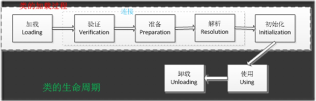

### 什么是类的加载

类的加载指的是将类的.class文件中的二进制数据读入到内存中，将其放在运行时数据区的方法区内，然后在堆区创建一个java.lang.Class对象，用来封装类在方法区内的数据结构。类的加载的最终产品是位于堆区中的Class对象，Class对象封装了类在方法区内的数据结构，并且向Java程序员提供了访问方法区内的数据结构的接口。

类加载器并不需要等到某个类被“首次主动使用”时再加载它，JVM规范允许类加载器在预料某个类将要被使用时就预先加载它，如果在预先加载的过程中遇到了.class文件缺失或存在错误，类加载器必须在程序首次主动使用该类时才报告错误（LinkageError错误）如果这个类一直没有被程序主动使用，那么类加载器就不会报告错误

#### 加载.class文件的方式

. 从本地系统中直接加载
. 通过网络下载.class文件
. 从zip，jar等归档文件中加载.class文件
. 从专有数据库中提取.class文件
. 将Java源文件动态编译为.class文件

### 类的生命周期

    其中类加载的过程包括了加载、验证、准备、解析、初始化五个阶段。在这五个阶段中，加载、验证、准备和初始化这四个阶段发生的顺序是确定的，而解析阶段则不一定，它在某些情况下可以在初始化阶段之后开始，这是为了支持Java语言的运行时绑定（也成为动态绑定或晚期绑定）。另外注意这里的几个阶段是按顺序开始，而不是按顺序进行或完成，因为这些阶段通常都是互相交叉地混合进行的，通常在一个阶段执行的过程中调用或激活另一个阶段。

#### 加载：查找并加载类的二进制数据

加载时类加载过程的第一个阶段，在加载阶段，虚拟机需要完成以下三件事情：

1. 通过一个类的全限定名来获取其定义的二进制字节流。
2. 将这个字节流所代表的静态存储结构转化为方法区的运行时数据结构。
3. 在Java堆中生成一个代表这个类的java.lang.Class对象，作为对方法区中这些数据的访问入口。

相对于类加载的其他阶段而言，加载阶段（准确地说，是加载阶段获取类的二进制字节流的动作）是可控性最强的阶段，因为开发人员既可以使用系统提供的类加载器来完成加载，也可以自定义自己的类加载器来完成加载。

加载阶段完成后，虚拟机外部的 二进制字节流就按照虚拟机所需的格式存储在方法区之中，而且在Java堆中也创建一个java.lang.Class类的对象，这样便可以通过该对象访问方法区中的这些数据。

#### 连接

– 验证：确保被加载的类的正确性

验证是连接阶段的第一步，这一阶段的目的是为了确保Class文件的字节流中包含的信息符合当前虚拟机的要求，并且不会危害虚拟机自身的安全。验证阶段大致会完成4个阶段的检验动作： 文件格式验证：验证字节流是否符合Class文件格式的规范；例如：是否以0xCAFEBABE开头、主次版本号是否在当前虚拟机的处理范围之内、常量池中的常量是否有不被支持的类型。 元数据验证：对字节码描述的信息进行语义分析（注意：对比javac编译阶段的语义分析），以保证其描述的信息符合Java语言规范的要求；例如：这个类是否有父类，除了java.lang.Object之外。 字节码验证：通过数据流和控制流分析，确定程序语义是合法的、符合逻辑的。 符号引用验证：确保解析动作能正确执行。 验证阶段是非常重要的，但不是必须的，它对程序运行期没有影响，如果所引用的类经过反复验证，那么可以考虑采用-Xverifynone参数来关闭大部分的类验证措施，以缩短虚拟机类加载的时间。

– 准备：为类的静态变量分配内存，并将其初始化为默认值

准备阶段是正式为类变量分配内存并设置类变量初始值的阶段，这些内存都将在方法区中分配。对于该阶段有以下几点需要注意：

1. 这时候进行内存分配的仅包括类变量（static），而不包括实例变量，实例变量会在对象实例化时随着对象一块分配在Java堆中。
2. 这里所设置的初始值通常情况下是数据类型默认的零值（如0、0L、null、false等），而不是被在Java代码中被显式地赋予的值。

假设一个类变量的定义为：public static int value = 3；

那么变量value在准备阶段过后的初始值为0，而不是3，因为这时候尚未开始执行任何Java方法，而把value赋值为3的putstatic指令是在程序编译后，存放于类构造器<clinit>（）方法之中的，所以把value赋值为3的动作将在初始化阶段才会执行。

====
这里还需要注意如下几点：

· 对基本数据类型来说，对于类变量（static）和全局变量，如果不显式地对其赋值而直接使用，则系统会为其赋予默认的零值，而对于局部变量来说，在使用前必须显式地为其赋值，否则编译时不通过。 · 对于同时被static和final修饰的常量，必须在声明的时候就为其显式地赋值，否则编译时不通过；而只被final修饰的常量则既可以在声明时显式地为其赋值，也可以在类初始化时显式地为其赋值，总之，在使用前必须为其显式地赋值，系统不会为其赋予默认零值。 · 对于引用数据类型reference来说，如数组引用、对象引用等，如果没有对其进行显式地赋值而直接使用，系统都会为其赋予默认的零值，即null。 · 如果在数组初始化时没有对数组中的各元素赋值，那么其中的元素将根据对应的数据类型而被赋予默认的零值。
====

3. 如果类字段的字段属性表中存在ConstantValue属性，即同时被final和static修饰，那么在准备阶段变量value就会被初始化为ConstValue属性所指定的值。

假设上面的类变量value被定义为： public static final int value = 3； 编译时Javac将会为value生成ConstantValue属性，在准备阶段虚拟机就会根据ConstantValue的设置将value赋值为3。

 – 解析：把类中的符号引用转换为直接引用

解析阶段是虚拟机将常量池内的符号引用替换为直接引用的过程，解析动作主要针对类或接口、字段、类方法、接口方法、方法类型、方法句柄和调用点限定符7类符号引用进行。符号引用就是一组符号来描述目标，可以是任何字面量。 直接引用就是直接指向目标的指针、相对偏移量或一个间接定位到目标的句柄。

#### 初始化

初始化，为类的静态变量赋予正确的初始值，JVM负责对类进行初始化，主要对类变量进行初始化。在Java中对类变量进行初始值设定有两种方式：

. 声明类变量是指定初始值
. 使用静态代码块为类变量指定初始值

JVM初始化步骤
1. 假如这个类还没有被加载和连接，则程序先加载并连接该类
2. 假如该类的直接父类还没有被初始化，则先初始化其直接父类
3. 假如类中有初始化语句，则系统依次执行这些初始化语句

##### 类初始化时机

只有当对类的主动使用的时候才会导致类的初始化，类的主动使用包括以下六种：

. 创建类的实例，也就是new的方式
. 访问某个类或接口的静态变量，或者对该静态变量赋值
. 调用类的静态方法
. 反射（如Class.forName(“com.shengsiyuan.Test”)）
. 初始化某个类的子类，则其父类也会被初始化
. Java虚拟机启动时被标明为启动类的类（Java Test），直接使用java.exe命令来运行某个主类

结束生命周期

在如下几种情况下，Java虚拟机将结束生命周期

* 执行了System.exit()方法
* 程序正常执行结束
* 程序在执行过程中遇到了异常或错误而异常终止
* 由于操作系统出现错误而导致Java虚拟机进程终止