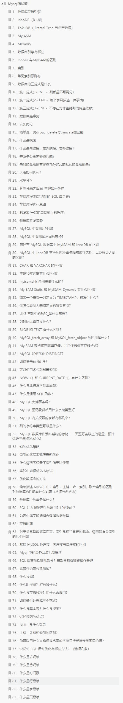

. 非关系型数据库和关系型数据库区别，优势比较
. MySQL 事务四大特性
. MySQL 常见存储引擎的区别
. MySQL基础架构
. SQL 的执行顺序
. 什么是临时表，何时删除临时表
. MySQL 常见索引类型
. varchar 和 char 的区别和使用场景
. 什么是 内连接、外连接、交叉连接、笛卡尔积
. 谈谈 SQL 优化的经验

. count(1) 和 count(*) 的区别是怎样的？

