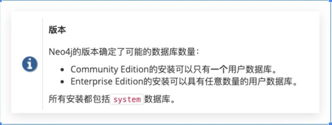

### Neo4j 3.x 与 Neo4j 4.x 对比总结

|=======
|Neo4j版本 | 3.4 社区版 | 4.1 社区版 | 3.4 企业版 | 4.1 企业版
|Server JDK 版本要求 | 1.8+ | 11+ | 1.8+ | 11+
|Driver JDK 版本要求 | 1.8+ | 1.8+ | 1.8+ | 1.8+
|支持动态创建/删除库 | 不支持 | 不支持 | 不支持 | 支持
|支持集群部署 | 不支持 | 不支持 | 支持 | 支持
|特性差别 |  |  |  |
|备注 |  |  |  |
|=======

使用Neo4j 4.1企业版中，可以同时创建和使用多个活动数据库。

====
在不考虑3.x 和4.x 的前提下，社区版和企业版在功能上没有本质区别。主要区别在如下几点： 容量：社区版最多支持 320 亿个节点、320 亿个关系和 640 亿个属性，而企业版没有这个限制； 并发：社区版只能部署成单实例，不能做集群。而企业版可以部署成高可用集群或因果集群，从而可以解决高并发量的问题； 容灾：由于企业版支持集群，部分实例出故障不会影响整个系统正常运行； 热备：社区版只支持冷备份，即需要停止服务后才能进行备份，而企业版支持热备，第一次是全量备份，后续是增量备份； 性能：社区版最多用到 4 个内核，而企业能用到全部内核，且对性能做了精心的优化； 支持：企业版客户能得到 5X10 电话支持（Neo4j 美国电话、邮件，微云数聚电话、微信、邮件）； **插件：**还有企业版可以使用Bloom、ETL这些工具，社区版不支持
====

#### 3.x 企业版与社区版对比

[options="compact"]
* 社区版功能

----
The Community Edition is a fully functional edition of Neo4j, suitable for single-instance deployments. It has full support for key Neo4j features, such as ACID compliance, Cypher, and programming APIs. It is ideal for learning Neo4j, do-it-yourself projects, and applications in small workgroups.
----

----
社区版是Neo4j的全功能版本，适用于单实例部署。 它全面支持Neo4j的关键特性，例如ACID合规性，Cypher查询语言和程序接口。 社区版非常适合学习Neo4j数据库，适用于DIY的应用以及小型工作团队中的应用。
----

* 企业版功能

----
The Enterprise Edition extends the functionality of Community Edition to include key features for performance and scalability, such as a clustering architecture and online backup functionality. Additional security features include role-based access control and LDAP support, for example, Active Directory. It is the choice for production systems with requirements for scale and availability, such as commercial solutions and critical internal solutions.
----

----
企业版扩展了社区版的功能，以使关键功能在性能和可伸缩性上的提升，例如集群架构和在线备份功能。 其他安全功能包括基于角色的访问控制和LDAP（Lightweight Directory Access Protocol：轻型目录访问协议）支持，例如Active Directory。 它是对规模和可用性有要求的生产系统的选择，例如商业解决方案和重要的内部解决方案。
----

功能细节对比

|====
| | 社区| 企业
| 属性图模型| ✔| ✔
| 本机图形处理和存储| ✔| ✔
| ACID交易| ✔| ✔
| 密码图查询语言| ✔| ✔
| Neo4j浏览器，语法高亮| ✔| ✔
| 螺栓二进制协议| ✔| ✔
| C＃，Java，JavaScript和Python的语言驱动程序| ✔| ✔
| 高性能本机API| ✔| ✔
| 高性能缓存| ✔| ✔
| 基于成本的查询优化器| ✔| ✔
| 图形算法库支持AI计划| ✔| ✔
| 通过本地标签索引快速写入| ✔| ✔
| 综合指标| ✔| ✔
| 全文节点和关系索引| ✔| ✔
| 开槽和编译的 Cypher运行时| --| ✔
| 属性存在约束| --| ✔
| 节点密钥架构约束| --| ✔
| 列出并终止正在运行的查询| --| ✔
| 自动重用空间| --| ✔
| 基于角色的访问控制| --| ✔
| 子图访问控制| --| ✔
| 财产级安全| --| ✔
| LDAP和Active Directory集成| --| ✔
| Kerberos安全性选项| --| ✔
|====

性能与扩展性对比

|====
| | 社区| 企业
| 可供全局应用使用的集群| --| ✔
| 多集群| --| ✔
| 企业锁管理器访问服务器上的所有内核| --| ✔
| 集群内加密| --| ✔
| 离线备份| ✔| ✔
| 在线备份| --| ✔
| 加密备份| --| ✔
| 滚动升级| --| ✔
| 自动缓存预热| --| ✔
| Neo4j驱动程序的路由和负载平衡| --| ✔
| 高级监控| --| ✔
| 图形大小限制| 34B节点，34B关系，68B属性| 没有限制
| 批量导入工具| ✔| ✔
| 批量导入工具，可恢复| --| ✔
|====

#### 4.x 企业版与社区版对比

* 社区版功能

----
The Community Edition is a fully functional edition of Neo4j, suitable for single-instance deployments. It has full support for key Neo4j features, such as ACID compliance, Cypher, and programming APIs. It is ideal for learning Neo4j, do-it-yourself projects, and applications in small workgroups.
----

----
社区版是Neo4j的全功能版本，适用于单实例部署。 它全面支持Neo4j的关键特性，例如ACID合规性，Cypher查询语言和程序接口。 社区版非常适合学习Neo4j数据库，适用于DIY的应用以及小型工作团队中的应用。
----

* 企业版功能

----
The Enterprise Edition extends the functionality of Community Edition to include key features for performance and scalability, such as a clustering architecture and online backup functionality. Additional security features include role-based access control and LDAP support, for example, Active Directory. It is the choice for production systems with requirements for scale and availability, such as commercial solutions and critical internal solutions.
----

----
企业版扩展了社区版的功能，以使关键功能在性能和可伸缩性上的提升，例如集群架构和在线备份功能。 其他安全功能包括基于角色的访问控制和LDAP（Lightweight Directory Access Protocol：轻型目录访问协议）支持，例如Active Directory。 它是对规模和可用性有要求的生产系统的选择，例如商业解决方案和重要的内部解决方案。
----

功能细节对比

|====
| | 社区| 企业
| 属性图模型| ✔| ✔
| 本机图形处理和存储| ✔| ✔
| ACID交易| ✔| ✔
| 密码图查询语言| ✔| ✔
| Neo4j浏览器，语法高亮| ✔| ✔
| 螺栓二进制协议| ✔| ✔
| C＃，Java，JavaScript和Python的语言驱动程序[1]| ✔| ✔
| 高性能本机API| ✔| ✔
| 高性能缓存| ✔| ✔
| 基于成本的查询优化器| ✔| ✔
| 图算法库支持AI计划[1]| ✔| ✔
| 通过本地标签索引快速写入| ✔| ✔
| 综合指标| ✔| ✔
| 全文节点和关系索引| ✔| ✔
| 存储副本| ✔| ✔
| 多个数据库（超越了system默认数据库）| --| ✔
| 开槽和流水线 Cypher运行时| --| ✔
| 属性存在约束| --| ✔
| 节点密钥约束| --| ✔
| 列出并终止正在运行的查询| --| ✔
| 自动重用空间| --| ✔
| 基于角色的访问控制| --| ✔
| 子图访问控制| --| ✔
| LDAP和Active Directory集成| --| ✔
| Kerberos安全性选项| --| ✔
|====

性能与扩展性对比

|====
| | 社区| 企业
| 可供全局应用使用的集群| --| ✔
| 企业锁管理器访问服务器上的所有内核| --| ✔
| 集群内加密| --| ✔
| 离线备份| ✔| ✔
| 在线备份| --| ✔
| 加密备份| --| ✔
| 滚动升级| --| ✔
| 自动缓存预热| --| ✔
| Neo4j驱动程序的路由和负载平衡| --| ✔
| 高级监控| --| ✔
| 图形大小限制| 34B节点，34B关系，68B属性| 没有限制
| 批量导入工具| ✔| ✔
| 批量导入工具，可恢复| --| ✔
|====

#### 社区版 3.x 与 4.x 对比

功能对比

|====
| | 社区| 企业
| 属性图模型| ✔| ✔
| 本机图形处理和存储| ✔| ✔
| ACID交易| ✔| ✔
| 密码图查询语言| ✔| ✔
| Neo4j浏览器，语法高亮| ✔| ✔
| 螺栓二进制协议| ✔| ✔
| C＃，Java，JavaScript和Python的语言驱动程序| ✔| ✔
| 高性能本机API| ✔| ✔
| 高性能缓存| ✔| ✔
| 基于成本的查询优化器| ✔| ✔
| 图形算法库支持AI计划| ✔| ✔
| 通过本地标签索引快速写入| ✔| ✔
| 综合指标| ✔| ✔
| 全文节点和关系索引| ✔| ✔
| 存储副本| | ✔
|====

性能与扩展对比

二者并无区别

#### 企业版 3.x 与 4.x 对比

功能对比

|====
| | 社区| 企业
| 属性图模型| ✔| ✔
| 本机图形处理和存储| ✔| ✔
| ACID交易| ✔| ✔
| 密码图查询语言| ✔| ✔
| Neo4j浏览器，语法高亮| ✔| ✔
| 螺栓二进制协议| ✔| ✔
| C＃，Java，JavaScript和Python的语言驱动程序[1]| ✔| ✔
| 高性能本机API| ✔| ✔
| 高性能缓存| ✔| ✔
| 基于成本的查询优化器| ✔| ✔
| 图算法库支持AI计划[1]| ✔| ✔
| 通过本地标签索引快速写入| ✔| ✔
| 综合指标| ✔| ✔
| 全文节点和关系索引| ✔| ✔
| 存储副本| | ✔
| 多个数据库（超越了system默认数据库）| | ✔
| 开槽和流水线 Cypher运行时| ✔| ✔
| 属性存在约束| ✔| ✔
| 节点密钥约束| ✔| ✔
| 列出并终止正在运行的查询| ✔| ✔
| 自动重用空间| ✔| ✔
| 基于角色的访问控制| ✔| ✔
| 子图访问控制| ✔| ✔
| 所有权级安全性| ✔|
| LDAP和Active Directory集成| | ✔
| Kerberos安全性选项| | ✔
|====

性能与扩展对比

二者并无区别

参考地址 以上内容参考自
[1]https://neo4j.com/docs/operations-manual/current/introduction/
[2]https://neo4j.com/docs/operations-manual/3.5/introduction/
[3]http://neo4j.com.cn