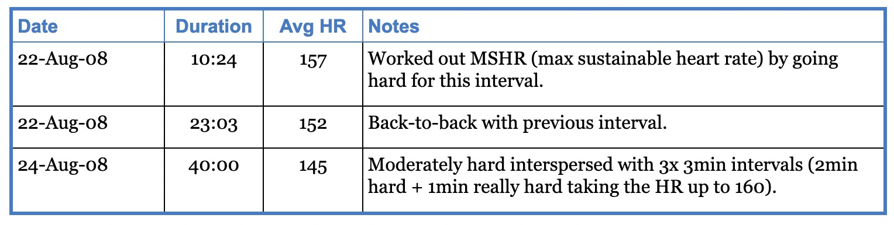

官方目录：

----
23. Tables
23.1. Example tables
23.2. Table input data formats
23.3. Table attributes
23.4. Column Specifiers
23.5. Cell Specifiers
23.6. Table styles
23.7. Markup attributes
23.8. Nested tables
23.9. DocBook table limitations
----

### 简单表格

源码如下：

----
[width="15%"]
|=======
|1 |2 |A
|3 |4 |B
|5 |6 |C
|=======
----

### 表格样式（加粗，合并，强调）

源码如下：

----
.An example table
[width="50%",cols=">s,^m,e",frame="topbot",options="header,footer"]
|==========================
|      2+|Columns 2 and 3
|1       |Item 1  |Item 1
|2       |Item 2  |Item 2
|3       |Item 3  |Item 3
|4       |Item 4  |Item 4
|footer 1|footer 2|footer 3
|==========================
----

### 水平和垂直数据

Short cells can be entered horizontally, longer cells vertically.
The default behavior is to strip leading and trailing blank lines within a cell.
These characteristics aid readability and data entry.

源码如下：

----
.Windtrainer workouts
[width="80%",cols="3,^2,^2,10",options="header"]
|=========================================================
|Date |Duration |Avg HR |Notes

|22-Aug-08 |10:24 | 157 |
Worked out MSHR (max sustainable heart rate) by going hard
for this interval.

|22-Aug-08 |23:03 | 152 |
Back-to-back with previous interval.

|24-Aug-08 |40:00 | 145 |
Moderately hard interspersed with 3x 3min intervals (2min
hard + 1min really hard taking the HR up to 160).

|=========================================================
----

### 导入一个csv文件内容为表格

Table 9. A table with externally sourced CSV data

源码如下：

----
[format="csv",cols="^1,4*2",options="header"]
|===================================================
ID,Customer Name,Contact Name,Customer Address,Phone
include::customers.csv[]
|===================================================
----

### 跨行列布局

image::表格5.png[]

源码如下：

----
[cols="e,m,^,>s",width="25%"]
|============================
|1 >s|2 |3 |4
^|5 2.2+^.^|6 .3+<.>m|7
^|8
|9 2+>|10
|============================
----

### 表格数据格式
AsciiDoc table data can be psv, dsv or csv formatted. The default table format is psv.

AsciiDoc psv (Prefix Separated Values) and dsv (Delimiter Separated Values) formats are cell oriented — the table is treated as a sequence of cells — there are no explicit row separators.

    psv prefixes each cell with a separator whereas dsv delimits cells with a separator.

    psv and dsv separators are Python regular expressions.

    The default psv separator contains cell specifier related named regular expression groups.

    The default dsv separator is :|\n (a colon or a new line character).

    psv and dsv cell separators can be escaped by preceding them with a backslash character.

Here are four psv cells (the second item spans two columns; the last contains an escaped separator):

----
|One 2+|Two and three |A \| separator character
----

### 表格属性
Tables can be customized by the following attributes:

----
format
    psv (default), dsv or csv (See Table Data Formats).
separator

    The cell separator. A Python regular expression (psv and dsv formats) or a single character (csv format).
frame

    Defines the table border and can take the following values: topbot (top and bottom), all (all sides), none and sides (left and right sides). The default value is all.
grid

    Defines which ruler lines are drawn between table rows and columns. The grid attribute value can be any of the following values: none, cols, rows and all. The default value is all.
align

    Use the align attribute to horizontally align the table on the page (works with HTML outputs only, has no effect on DocBook outputs). The following values are valid: left, right, and center.
float

    Use the float attribute to float the table left or right on the page (works with HTML outputs only, has no effect on DocBook outputs). Floating only makes sense in conjunction with a table width attribute value of less than 100% (otherwise the table will take up all the available space). float and align attributes are mutually exclusive. Use the unfloat::[] block macro to stop floating.
halign

    Use the halign attribute to horizontally align all cells in a table. The following values are valid: left, right, and center (defaults to left). Overridden by Column specifiers and Cell specifiers.
valign

    Use the valign attribute to vertically align all cells in a table. The following values are valid: top, bottom, and middle (defaults to top). Overridden by Column specifiers and Cell specifiers.
options

    The options attribute can contain comma separated values, for example: header, footer. By default header and footer rows are omitted. See attribute options for a complete list of available table options.
cols

    The cols attribute is a comma separated list of column specifiers. For example cols="2<p,2*,4p,>".

        If cols is present it must specify all columns.

        If the cols attribute is not specified the number of columns is calculated as the number of data items in the first line of the table.

        The degenerate form for the cols attribute is an integer specifying the number of columns e.g. cols=4.

width

    The width attribute is expressed as a percentage value ("1%"…"99%"). The width specifies the table width relative to the available width. HTML backends use this value to set the table width attribute. It’s a bit more complicated with DocBook, see the DocBook table widths sidebar.
filter

    The filter attribute defines an external shell command that is invoked for each cell. The built-in asciidoc table style is implemented using a filter.
----

### 23.4. Column Specifiers

Column specifiers define how columns are rendered and appear in the table cols attribute. A column specifier consists of an optional column multiplier followed by optional alignment, width and style values and is formatted like:

----
[<multiplier>*][<align>][<width>][<style>]
----

    All components are optional. The multiplier must be first and the style last. The order of <align> or <width> is not important.

    Column <width> can be either an integer proportional value (1…) or a percentage (1%…100%). The default value is 1. To ensure portability across different backends, there is no provision for absolute column widths (not to be confused with output column width markup attributes which are available in both percentage and absolute units).

    The <align> column alignment specifier is formatted like:

----
    [<horizontal>][.<vertical>]
----

    Where <horizontal> and <vertical> are one of the following characters: <, ^ or > which represent left, center and right horizontal alignment or top, middle and bottom vertical alignment respectively.

    A <multiplier> can be used to specify repeated columns e.g. cols="4*<" specifies four left-justified columns. The default multiplier value is 1.

    The <style> name specifies a table style to used to markup column cells (you can use the full style names if you wish but the first letter is normally sufficient).

    Column specific styles are not applied to header rows.

23.5. Cell Specifiers

Cell specifiers allow individual cells in psv formatted tables to be spanned, multiplied, aligned and styled. Cell specifiers prefix psv | delimiters and are formatted like:

[*|+][<align>][<style>]

     specifies horizontal and vertical cell spans (+ operator) or the number of times the cell is replicated (* operator).  is formatted like:

    [<colspan>][.<rowspan>]

    Where <colspan> and <rowspan> are integers specifying the number of columns and rows to span.

    <align> specifies horizontal and vertical cell alignment an is the same as in column specifiers.

    A <style> value is the first letter of table style name.

For example, the following psv formatted cell will span two columns and the text will be centered and emphasized:

----
`2+^e| Cell text`
----

### 23.6. Table styles

Table styles can be applied to the entire table (by setting the style attribute in the table’s attribute list) or on a per column basis (by specifying the style in the table’s cols attribute). Table data can be formatted using the following predefined styles:

default

    The default style: AsciiDoc inline text formatting; blank lines are treated as paragraph breaks.
emphasis

    Like default but all text is emphasised.
monospaced

    Like default but all text is in a monospaced font.
strong

    Like default but all text is bold.
header

    Apply the same style as the table header. Normally used to create a vertical header in the first column.
asciidoc

    With this style table cells can contain any of the AsciiDoc elements that are allowed inside document sections. This style runs asciidoc(1) as a filter to process cell contents. See also Docbook table limitations.
literal

    No text formatting; monospaced font; all line breaks are retained (the same as the AsciiDoc LiteralBlock element).
verse

    All line breaks are retained (just like the AsciiDoc verse paragraph style).

