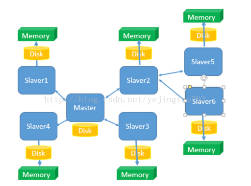
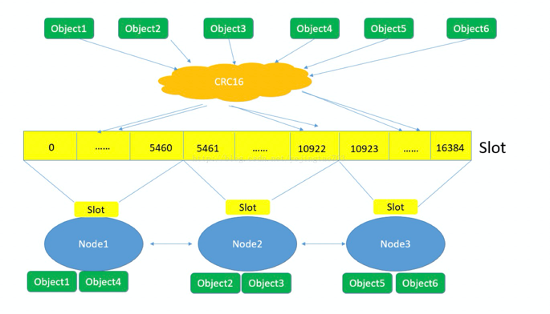
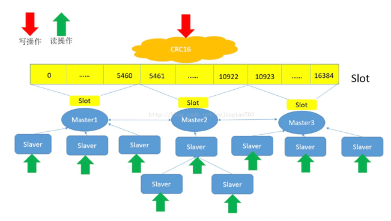

参考：https://blog.csdn.net/yejingtao703/article/details/78484151

节点主从：
主从设计不算什么新鲜玩意，在数据库中我们也经常用主从来做读写分离，直接上图：

图上能看得到的信息：

1， 只有1个Master，可以有N个slaver，而且Slaver也可以有自己的Slaver，由于这种主从的关系决定他们是在配置阶段就要指定他们的上下级关系，而不是Zookeeper那种平行关系是自主推优出来的。

2， 读写分离，Master只负责写和同步数据给Slaver，Slaver承担了被读的任务，所以Slaver的扩容只能提高读效率不能提高写效率。

3， Slaver先将Master那边获取到的信息压入磁盘，再load进内存，client端是从内存中读取信息的，所以Redis是内存数据库。

当一个新的Slaver加入到这个集群时，会主动找Master来拜码头，Master发现新的小弟后将全量数据发送给新的Slaver，数据量越大性能消耗也就越大，所以尽量避免在运行时做Slaver的扩容。

简单总结下主从模式的设计：

优点：读写分离，通过增加Slaver可以提高并发读的能力。

缺点：Master写能力是瓶颈。

          虽然理论上对Slaver没有限制但是维护Slaver开销总将会变成瓶颈。

          Master的Disk大小也将会成为整个Redis集群存储容量的瓶颈。

哈希Slot：
这个艺名看起来很文艺，但也不是什么新技术，他的真名就叫分表分库，再上一个图：

图上能看到的信息：

1， 对象保存到Redis之前先经过CRC16哈希到一个指定的Node上，例如Object4最终Hash到了Node1上。

2， 每个Node被平均分配了一个Slot段，对应着0-16384，Slot不能重复也不能缺失，否则会导致对象重复存储或无法存储。

3， Node之间也互相监听，一旦有Node退出或者加入，会按照Slot为单位做数据的迁移。例如Node1如果掉线了，0-5640这些Slot将会平均分摊到Node2和Node3上,由于Node2和Node3本身维护的Slot还会在自己身上不会被重新分配，所以迁移过程中不会影响到5641-16384Slot段的使用。

简单总结下哈希Slot的优缺点：

缺点：每个Node承担着互相监听、高并发数据写入、高并发数据读出，工作任务繁重

优点：将Redis的写操作分摊到了多个节点上，提高写的并发能力，扩容简单。

双剑合并：

看到这里大家也就发现了，主从和哈希的设计优缺点正好是相互弥补的，将图一每一套主从对应到图二中的每一个Node，就是Redis集群的终极形态，先Hash分逻辑节点，然后每个逻辑节点内部是主从，如图：

想扩展并发读就添加Slaver，想扩展并发写就添加Master，想扩容也就是添加Master，任何一个Slaver或者几个Master挂了都不会是灾难性的故障。